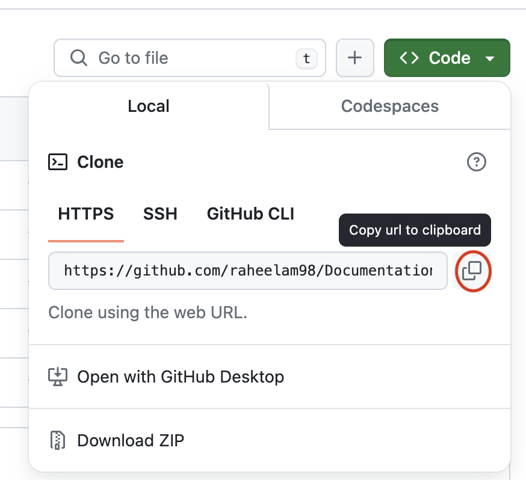
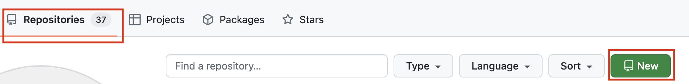
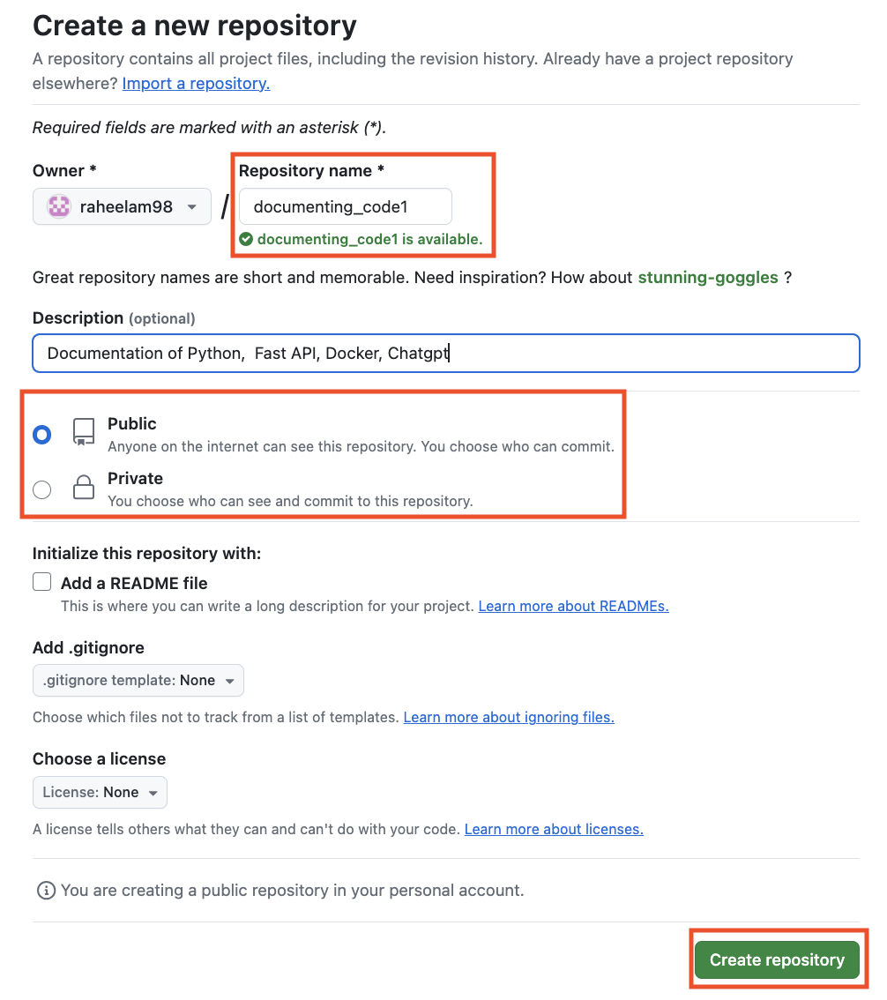
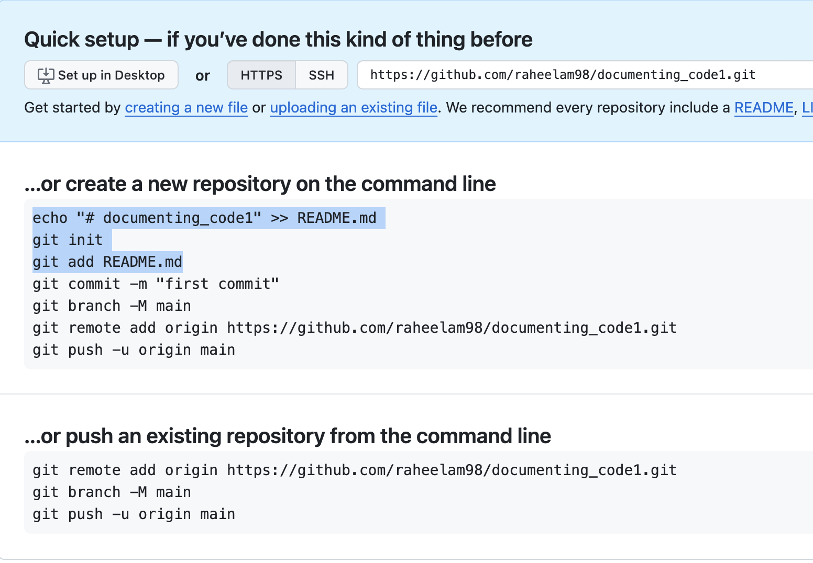
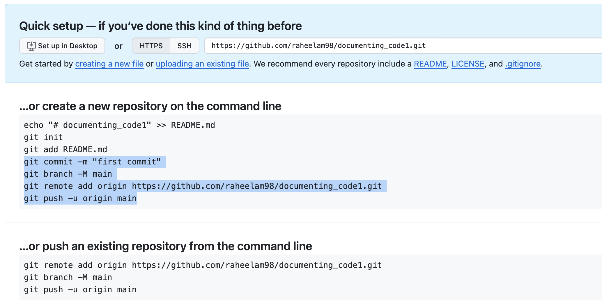
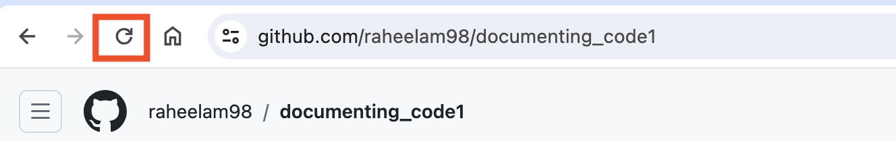
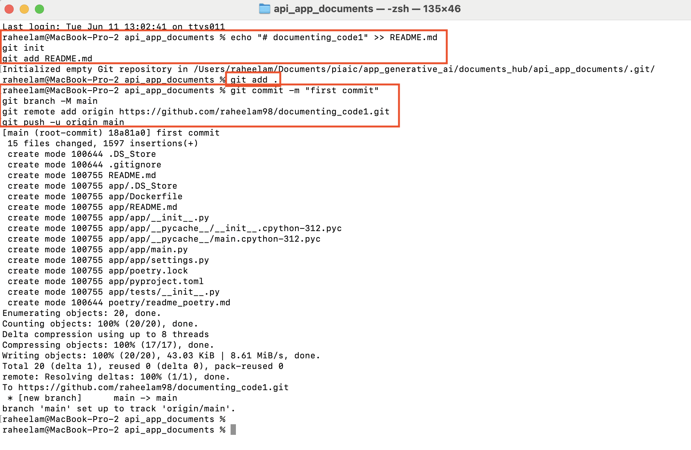

# Commands 

Documentation of Python, Chatgpt , Fast API, Docker Container, Kubernetes 

**Note**
File Permissions with chmod -- only for mac user

current working directory
```bash
pwd
```

grants all users full read, write, and execute permissions on the specified folder and its contents
```bash
chmod <permission> <directory or filename>

sudo chmod -R 777 /path/to/folder

sudo chmod -R 777  /Users/user-name/Documents/folder-name
```

view hidden files on Mac
Press Command + Shift + . (the period key). This will show hidden files in the folder.

To hide the files again, press Command + Shift + . again.

**clone repository**

Note :- copy URL 

<div style="text-align: center;">
    </img>
</div>


```shell
git clone URL
```

**push code to repository** 

(i) :- Open terminal

(ii) :-  Set your local project as the current working directory

current working directory
```shell
pwd
```

(iii)  :-  copy path 

```shell
cd path
```

(iv)  :- check files
```shell
ls
```

### push code to repository :: (case I)

Step 1 :- Initialize the local directory as a Git repository 

```shell
git init
```

Step 2 :- Add the files in your new local repository. Your files will now be the staged for their first commit.

```shell
git add .

git status
```
note:- dot is use for current dir

Step 3 :-  Commit the file that you have staged in your local repository
(Connect the files with local repository)

```bash
git commit -m “first commit”
```
flag -m :- message

Step 4 :-  Push the code in your local repository  to Github

```bash
git push --set-upstream origin main
```

Add username and password (if required / for first time)

### push code into specific repository  in two minute:: (case II)

#### create new repository

**Step I :- select new** 

<div style="text-align: center;">
    </img>
</div>

**Step II :- create repository**

<div style="text-align: center;">
    </img>
</div>

**Step III  :- copy first 3 lines and past on terminal** 

note :- app terminal

<div style="text-align: center;">
    </img>
</div>

press enter

**Step IV :-  write command**

```bash
git add .
```
note:- dot is use for current dir

**Step V :- copy last 4 lines and past on terminal**

<div style="text-align: center;">
    </img>
</div>

press enter

**Step VI  :- refresh page**

<div style="text-align: center;">
    </img>
</div>

### terminal 

<div style="text-align: center;">
    </img>
</div>

[Push Code to your GitHub Account - Under 3 Minutes](https://www.youtube.com/watch?v=vpRkAoCqX3o)

[How to Show Hidden Files on Mac](https://www.youtube.com/watch?v=8HvedBfa7S0) 


#### …or create a new repository on the command line

echo "# Document_Coding" >> README.md
git init
git add README.md
git commit -m "first commit"
git branch -M main
git remote add origin https://github.com/raheelam98/Document_Coding.git
git push -u origin main

####  …or push an existing repository from the command line

git remote add origin https://github.com/raheelam98/Document_Coding.git

git branch -M main

git push -u origin main

**Clone Repository**

```shell
git clone <repository-url>  
```

### Online Class (Quater 3)

#### Playlist

[Modern Cloud Native AI Stack: Python, Poetry, Docker.. Online Class)](https://www.youtube.com/playlist?list=PL0vKVrkG4hWqWNAr6rcX0gOvU_eOULnJN)

[Docker - Complete Tutorial: (Docker File, Image, Container](https://www.youtube.com/playlist?list=PL0vKVrkG4hWoTh2SaepYf9N8ywxz_Cyfx)

[Apache Kafka - Event Driven Architecture](https://www.youtube.com/playlist?list=PL0vKVrkG4hWrlSxLssJeuyMKGIegYiUyz)

[Generative AI with Cloud-Native Power: Microservices, Multi-Agent](https://www.youtube.com/playlist?list=PL0vKVrkG4hWpk12F7wO41kdFWhuXuigDW)

[Cloud Deployment - Azure Container Apps](https://www.youtube.com/playlist?list=PL0vKVrkG4hWrqwmlQ6k8ArJ93BrwX6V4l)


#### Docker Compose
[GenAI Quarter 5 Online Class 08: Docker Compose - Running Multi Containers with Docker Compose](https://www.youtube.com/watch?v=l5eZMAhDwhQ&list=PL0vKVrkG4hWoTh2SaepYf9N8ywxz_Cyfx&index=6)

#### Dev Container
[Dev Container Online Class 06: What is Dev Container (Development inside Containers) - Docker](https://www.youtube.com/watch?v=h32qw986-tI)

#### Kafka
[GenAI Quarter 5 Online Class 12: Interact with Kafka using aiokafka - A Python Library for Kafka](https://www.youtube.com/watch?v=PAU05OrLgho)

[GenAI Quarter 5 Online Class 13: Serialization and Deserialization Kafka Messages](https://www.youtube.com/watch?v=qVbAYHxW3xg&list=PL0vKVrkG4hWqWNAr6rcX0gOvU_eOULnJN&index=13)

#### Portobuf
[GenAI Quarter 5 Online Class 14: Protobuf in Kafka & Introduction to Kong - An API Gateway](https://www.youtube.com/watch?v=nMXMV48EiQA)

[GenAI Quarter 5 Online Class 13: Serialization and Deserialization Kafka Messages](https://www.youtube.com/watch?v=qVbAYHxW3xg)

#### Pg Admin
[GenAI Quarter 5 Online Class 08: Docker Compose - Running Multi Containers with Docker Compose](https://www.youtube.com/watch?v=l5eZMAhDwhQ&t=3117s)

[GenAI Quarter 5 Online Class 07: Docker Compose - Orchestrate Multi-Container Applications with Ease](https://www.youtube.com/watch?v=cpu44VE_J1I&t=5554s) 

### Github

[Even Driven Architecture](https://github.com/panaverse/learn-generative-ai/tree/main/05_microservices_all_in_one_platform/15_event_driven)

[Docker Compose with Database Service](https://github.com/panaverse/learn-generative-ai/tree/main/05_microservices_all_in_one_platform/14_docker/05_compose_db)

[Synchronous Inter Services Messages between Microservices](https://github.com/panaverse/learn-generative-ai/tree/main/05_microservices_all_in_one_platform/14_docker/07_synchronous_messages)

[A Challenge: FastAPI Event Driven Microservices Development With Kafka, KRaft, Docker Compose, and Poetry](https://github.com/panaverse/learn-generative-ai/tree/main/05_microservices_all_in_one_platform/15_event_driven/00_eda_challenge)


